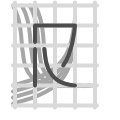

<h1> Ryder</h1>

Ryder is a .NET Core library providing the ability to redirect method calls from
one method to another. By extension, it can also redirect property accesses, and event
subscriptions / raises.

[](https://nuget.org/packages/Ryder)
[](../../releases/latest)
[](../../issues)
[](./LICENSE.md)

## Get started
#### Redirect a method
```csharp
public static int Incremented(int nbr) => nbr + 1;
public static int Decremented(int nbr) => nbr - 1;

Incremented(1); // => 2.

MethodRedirection r = Redirection.Redirect<Func<int, int>>(Incremented, Decremented);

Incremented(1); // => 0.

// You can also invoke the original method:
r.InvokeOriginal(null, 1); // => 2.

// You can also stop the redirection...
r.Stop(); // or r.IsRedirecting = false, or r.Dispose().
Incremented(1); // => 2.

// ... and restart it
r.Start(); // or r.IsRedirecting = true, unless you disposed it, in which case it's no longer usable
Incremented(1); // => 0.
```

#### Using Reactive Extensions
```csharp
MethodInfo method = typeof(DateTime)
    .GetProperty(nameof(DateTime.Now), BindingFlags.Static | BindingFlags.Public)
    .GetGetMethod();

int count = 0;
DateTime bday = new DateTime(1955, 10, 28);

// Make "DateTime.get_Now()" return once "bday" every two calls.
using (Redirection.Observe(method)
                  .Where(_ => count++ % 2 == 0)
                  .Subscribe(ctx => ctx.ReturnValue = bday))
{
    DateTime.Now.ShouldBe(bday);
    DateTime.Now.ShouldNotBe(bday);
    DateTime.Now.ShouldBe(bday);
    DateTime.Now.ShouldNotBe(bday);
}

DateTime.Now.ShouldNotBe(bday);
DateTime.Now.ShouldNotBe(bday);
```

#### Other features
##### Any `Redirection` also defines the following members:
- `bool IsRedirecting { get; set; }`
- `void Start()`
- `void Stop()`

##### Redirections can be created in multiple ways:
- `MethodRedirection`: `Redirect(Expression<..>, Expression<..>)`, `Redirect(Delegate, Delegate)`, `Redirect(MethodBase, MethodBase)`.
- `PropertyRedirection`: `Redirect(Expression<..>, Expression<..>)`, `Redirect(PropertyInfo, PropertyInfo)`.
- `EventRedirection`: `Redirect(Expression<..>, Expression<..>)`, `Redirect(EventInfo, EventInfo)`.

##### Tests
All features are tested in [Ryder.Tests](./Ryder.Tests). Please check it out, as it contains some real-world-usage code.

##### Gloriously unsafe:
By default, Ryder makes many runtime checks when you create a new `Redirection` ([see by yourself](./Ryder/Redirection.cs)). However, should you decide to do some *very* experimental and unsafe stuff, disabling all those checks is as easy as setting the static property `Redirection.SkipChecks` to `true`.

## Installation
You can install Ryder through the NuGet package manager:
```powershell
Install-Package Ryder
```

Alternatively, if you don't want to add a dependency, you can copy-paste the
[`Ryder.Lightweight.cs`](./Ryder.Lightweight/Ryder.Lightweight.cs) file in your project. Caution, however, since this version only provides the `MethodRedirection` (simply called `Redirection`), and performs no safety checks.

## Additional notes
- Make sure the method you want to redirect does not get inlined by the JIT; if it does get inlined, redirecting it will most likely break stuff in unexpected ways, or do nothing at all. Additionally, if the method you redirect hasn't been jitted yet, the same problems may arise.
- In order to keep the GC from collecting jitted methods, Ryder keeps static references to them. Those references are only deleted when `Redirection.Dispose()` is called, after which the `Redirection` is no longer guaranteed to work.

## Inspiration
Ryder is highly inspired by [Harmony](https://github.com/pardeike/Harmony), but tries
to take a very minimal approach to redirection, instead of providing the ability to patch individual instructions. Moreover, it was made with .NET Core in mind.

# Projects using Ryder
- The [AnyConstraint](https://github.com/6A/AnyConstraint.Analyzer) analyzer uses [Ryder.Lightweight](./Ryder.Lightweight) to allow any constraint to be used, including `Delegate` and `Enum`.
- [Cometary](https://github.com/6A/Cometary) highly modifies the [Roslyn](https://github.com/dotnet/roslyn) compilation process in order to add custom features to C#.